# Relatorio de Clustering no Dataset CDC Diabetes Health Indicators

## 1. Introducao
Este trabalho tem como objetivo aplicar tecnicas de clustering a um dataset real da area da saude, com foco no tema diabetes. A proposta consiste em identificar perfis de individuos com caracteristicas semelhantes de saude, estilo de vida e demografia, de modo a observar padroes latentes sem usar o rotulo clinico durante o treinamento dos algoritmos.

## 2. Descricao do Dataset
O dataset utilizado foi o **CDC Diabetes Health Indicators**, derivado do **Behavioral Risk Factor Surveillance System (BRFSS) 2015** do CDC. A base analisada contem **253680 instancias** e **22 variaveis** no arquivo original, sendo **21 variaveis de entrada** usadas na clusterizacao.
As variaveis representam indicadores de saude, comportamento, acesso a servicos e aspectos demograficos, incluindo `HighBP` (indicador de pressao arterial elevada), `HighChol` (indicador de colesterol elevado), `CholCheck` (realizacao de exame de colesterol), `BMI` (indice de massa corporal), `Smoker` (historico de tabagismo), `Stroke` (historico de AVC), `HeartDiseaseorAttack` (historico de doenca cardiaca ou infarto), `PhysActivity` (pratica de atividade fisica), `Fruits` (consumo de frutas), `Veggies` (consumo de vegetais), `HvyAlcoholConsump` (consumo excessivo de alcool), `AnyHealthcare` (acesso a qualquer cobertura de saude), `NoDocbcCost` (dificuldade de consulta por custo), `GenHlth` (autoavaliacao da saude geral), `MentHlth` (dias com pior saude mental), `PhysHlth` (dias com pior saude fisica), `DiffWalk` (dificuldade para caminhar), `Sex` (sexo), `Age` (faixa etaria), `Education` (escolaridade), `Income` (renda). O campo `Diabetes_binary` corresponde ao rotulo original do problema e foi removido antes da clusterizacao, sendo readicionado apenas depois para interpretacao dos grupos encontrados.

## 3. Problema Definido
O problema investigado neste trabalho consiste em verificar se individuos podem ser agrupados em perfis distintos de saude e risco associados ao diabetes, com base em indicadores como BMI, pressao alta, colesterol alto, idade, saude geral, atividade fisica, renda e escolaridade.
Apos a clusterizacao, o rotulo original `Diabetes_binary` foi utilizado apenas para interpretar os clusters e nunca como entrada nos algoritmos nem como criterio principal de selecao dos modelos.

## 4. Analise Descritiva
Na analise univariada foram calculadas estatisticas descritivas como media, mediana, desvio padrao, quartis e valores extremos para todas as variaveis numericas. A Tabela a seguir apresenta um recorte dessas estatisticas:

| variable | mean | median | std | min | q1 | q2 | q3 | max |
| --- | --- | --- | --- | --- | --- | --- | --- | --- |
| HighBP | 0.4290 | 0.0000 | 0.4949 | 0.0000 | 0.0000 | 0.0000 | 1.0000 | 1.0000 |
| HighChol | 0.4241 | 0.0000 | 0.4942 | 0.0000 | 0.0000 | 0.0000 | 1.0000 | 1.0000 |
| CholCheck | 0.9627 | 1.0000 | 0.1896 | 0.0000 | 1.0000 | 1.0000 | 1.0000 | 1.0000 |
| BMI | 28.3824 | 27.0000 | 6.6087 | 12.0000 | 24.0000 | 27.0000 | 31.0000 | 98.0000 |
| Smoker | 0.4432 | 0.0000 | 0.4968 | 0.0000 | 0.0000 | 0.0000 | 1.0000 | 1.0000 |
| Stroke | 0.0406 | 0.0000 | 0.1973 | 0.0000 | 0.0000 | 0.0000 | 0.0000 | 1.0000 |
| HeartDiseaseorAttack | 0.0942 | 0.0000 | 0.2921 | 0.0000 | 0.0000 | 0.0000 | 0.0000 | 1.0000 |
| PhysActivity | 0.7565 | 1.0000 | 0.4292 | 0.0000 | 1.0000 | 1.0000 | 1.0000 | 1.0000 |
| Fruits | 0.6343 | 1.0000 | 0.4816 | 0.0000 | 0.0000 | 1.0000 | 1.0000 | 1.0000 |
| Veggies | 0.8114 | 1.0000 | 0.3912 | 0.0000 | 1.0000 | 1.0000 | 1.0000 | 1.0000 |

Os graficos abaixo ilustram distribuicoes relevantes para o relatorio:

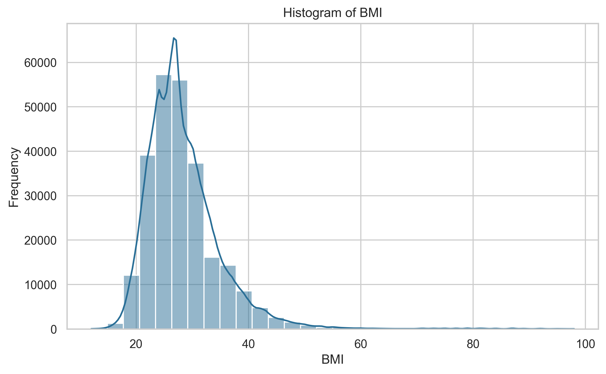

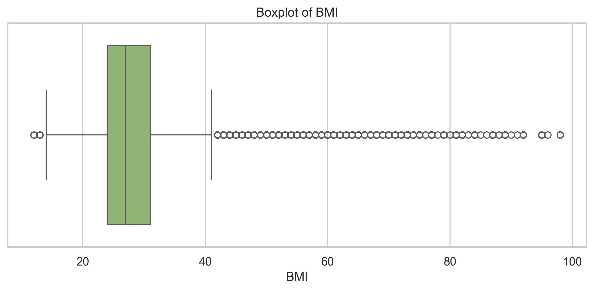

Na analise bivariada foram calculadas correlacoes de Pearson e Spearman. As correlacoes absolutas mais fortes observadas foram:

**Top correlacoes de Pearson**

| variable_1 | variable_2 | correlation |
| --- | --- | --- |
| GenHlth | PhysHlth | 0.5244 |
| PhysHlth | DiffWalk | 0.4784 |
| GenHlth | DiffWalk | 0.4569 |
| Education | Income | 0.4491 |
| GenHlth | Income | -0.3700 |

**Top correlacoes de Spearman**

| variable_1 | variable_2 | correlation |
| --- | --- | --- |
| Education | Income | 0.4520 |
| GenHlth | PhysHlth | 0.4518 |
| GenHlth | DiffWalk | 0.4228 |
| PhysHlth | DiffWalk | 0.4150 |
| GenHlth | Income | -0.3543 |

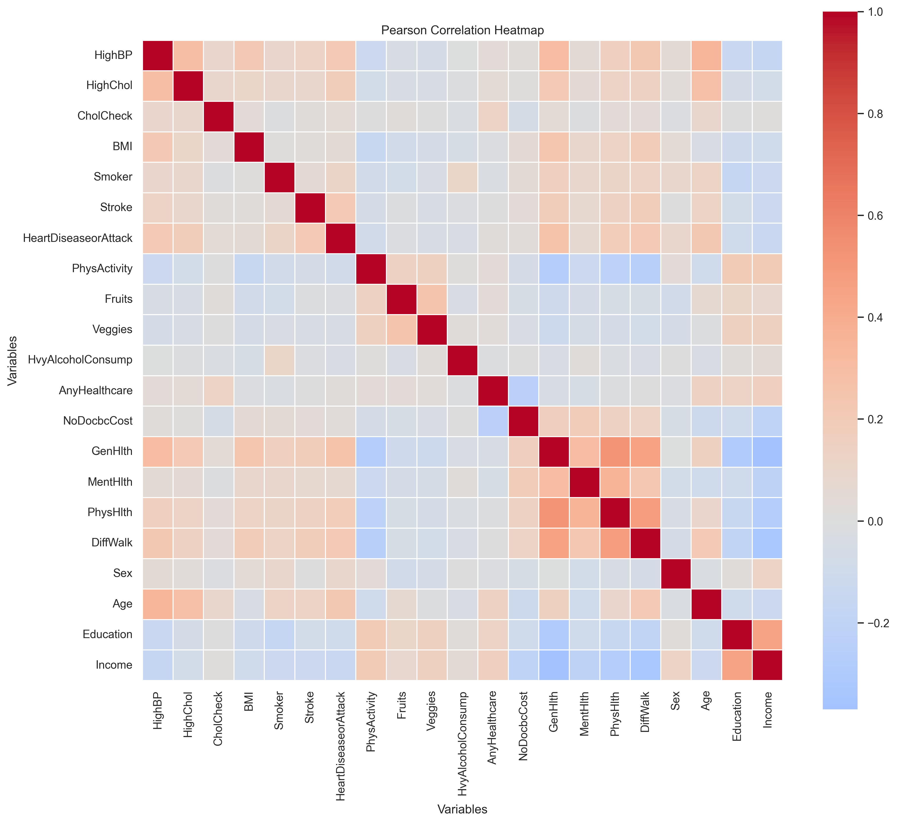

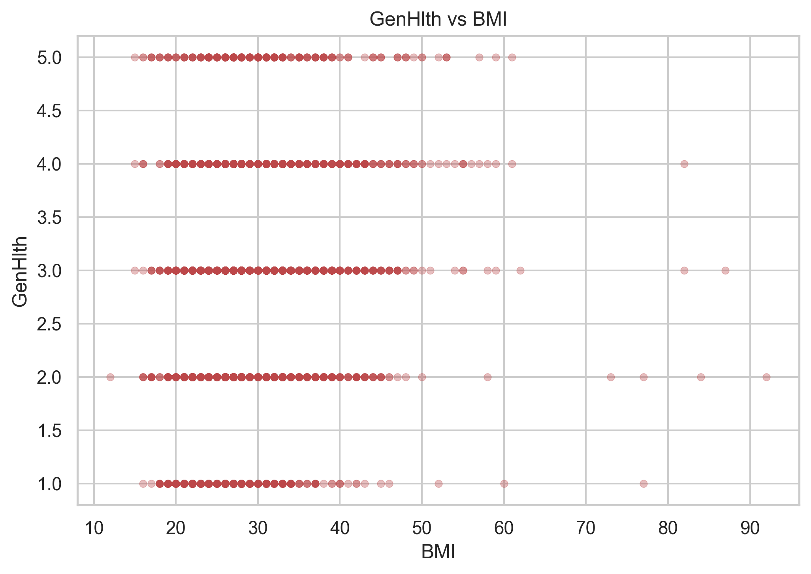

Na analise multivariada foi aplicado PCA com dois componentes apenas para visualizacao exploratoria. A variancia explicada acumulada pelos dois primeiros componentes foi de **0.2511**, o que indica que a projecao em 2D deve ser interpretada como apoio visual e nao como representacao completa da estrutura dos dados.

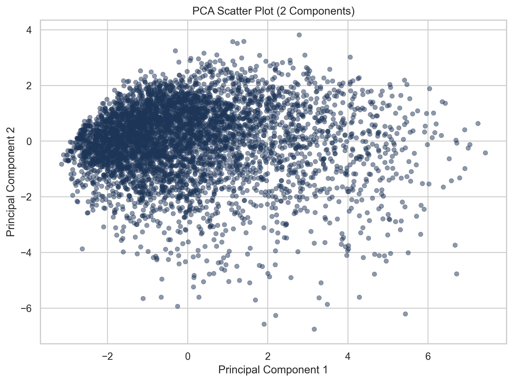

## 5. Pre-processamento
O pre-processamento foi executado apenas sobre as variaveis de entrada. Nao foram identificadas colunas de identificacao, nomes ou datas a serem removidas. Tambem nao foram observados valores faltantes no CSV utilizado, de modo que nao foi necessario imputar medias, medianas ou modas.
Mesmo sem faltantes, foram detectados **343041 valores potencialmente discrepantes** pelo criterio do intervalo interquartil (IQR). Em vez de remover instancias, foi aplicado clipping nos limites inferior e superior de cada variavel numerica. Na etapa final, as variaveis foram padronizadas com `StandardScaler` para adequar a escala aos algoritmos baseados em distancia. O PCA foi usado apenas para visualizacao e nao como base principal de clusterizacao.

## 6. Algoritmos de Clustering
Foram executados tres algoritmos de clustering, todos sem utilizar o rotulo `Diabetes_binary`:

- **K-Means**: teste de `k` de 2 a 10, com `random_state` fixo e `n_init = 10`.
- **Agglomerative Clustering**: teste de `n_clusters` de 2 a 10 com os linkages `ward`, `complete`, `average` e `single`.
- **DBSCAN**: teste de `eps` em `[0.5, 0.8, 1.0, 1.5, 2.0, 2.5, 3.0]` e `min_samples` em `[5, 10, 20, 50]`.

Como o dataset possui mais de 250 mil registros, foi utilizada amostragem reprodutivel em algoritmos mais custosos. No experimento final, K-Means trabalhou com 20.000 instancias, Agglomerative com 10.000 instancias estratificadas pelo rotulo apenas para tornar a amostra representativa, e DBSCAN com 10.000 instancias aleatorias. Em nenhum caso o rotulo foi usado no treinamento.

## 7. Metricas de Avaliacao
A comparacao dos algoritmos foi feita com metricas internas de clustering: **Silhouette Score**, **Davies-Bouldin Index** e **Calinski-Harabasz Score**. O Silhouette Score mede coesao e separacao entre grupos, sendo melhor quanto maior. O Davies-Bouldin Index mede sobreposicao entre clusters, sendo melhor quanto menor. O Calinski-Harabasz Score compara dispersao entre clusters e dispersao interna, sendo melhor quanto maior.
Essas metricas sao internas e nao usam o rotulo `Diabetes_binary`, o que esta alinhado com a natureza nao supervisionada do problema.

## 8. Resultados
A Tabela seguinte resume a melhor configuracao de cada algoritmo:

| algorithm | k | inertia | n_clusters_found | silhouette_score | davies_bouldin_index | calinski_harabasz_score | used_sampling | sampling_strategy | original_size | sample_size | linkage | n_clusters | configuration | eps | min_samples | n_noise_points | noise_percentage |
| --- | --- | --- | --- | --- | --- | --- | --- | --- | --- | --- | --- | --- | --- | --- | --- | --- | --- |
| kmeans | 2.0000 | 203618.1875 | 2 | 0.1563 | 2.3314 | 3545.9118 | True | random | 253680 | 20000 | nan | nan | nan | nan | nan | nan | nan |
| agglomerative | nan | nan | 2 | 0.2119 | 0.6599 | 2.2271 | True | stratified | 253680 | 10000 | single | 2.0000 | single_k_2 | nan | nan | nan | nan |
| dbscan | nan | nan | 3 | 0.4194 | 0.8219 | 179.7665 | True | random | 253680 | 10000 | nan | nan | eps_0.5_min_samples_20 | 0.5000 | 20.0000 | 9825.0000 | 98.2500 |

Os resultados completos por algoritmo foram salvos em CSV e seus principais trechos sao apresentados a seguir.

**K-Means**

| algorithm | k | inertia | n_clusters_found | silhouette_score | davies_bouldin_index | calinski_harabasz_score | used_sampling | sampling_strategy | original_size | sample_size |
| --- | --- | --- | --- | --- | --- | --- | --- | --- | --- | --- |
| kmeans | 2 | 203618.1875 | 2 | 0.1563 | 2.3314 | 3545.9118 | True | random | 253680 | 20000 |
| kmeans | 3 | 186273.1196 | 3 | 0.1223 | 2.3876 | 2868.9767 | True | random | 253680 | 20000 |
| kmeans | 4 | 176139.6000 | 4 | 0.1016 | 2.4230 | 2406.0515 | True | random | 253680 | 20000 |
| kmeans | 5 | 168650.5330 | 5 | 0.1045 | 2.4047 | 2106.5484 | True | random | 253680 | 20000 |
| kmeans | 6 | 161607.2737 | 6 | 0.0985 | 2.2883 | 1932.8839 | True | random | 253680 | 20000 |
| kmeans | 7 | 156291.4219 | 7 | 0.0931 | 2.2166 | 1778.7676 | True | random | 253680 | 20000 |
| kmeans | 8 | 151758.6319 | 8 | 0.1005 | 2.3233 | 1655.4240 | True | random | 253680 | 20000 |
| kmeans | 9 | 147503.9220 | 9 | 0.1003 | 2.2616 | 1562.2797 | True | random | 253680 | 20000 |
| kmeans | 10 | 143797.0302 | 10 | 0.0957 | 2.2222 | 1481.6787 | True | random | 253680 | 20000 |

**Agglomerative Clustering**

| algorithm | linkage | n_clusters | configuration | n_clusters_found | silhouette_score | davies_bouldin_index | calinski_harabasz_score | used_sampling | sampling_strategy | original_size | sample_size |
| --- | --- | --- | --- | --- | --- | --- | --- | --- | --- | --- | --- |
| agglomerative | single | 2 | single_k_2 | 2 | 0.2119 | 0.6599 | 2.2271 | True | stratified | 253680 | 10000 |
| agglomerative | average | 2 | average_k_2 | 2 | 0.1815 | 1.9640 | 935.0690 | True | stratified | 253680 | 10000 |
| agglomerative | ward | 2 | ward_k_2 | 2 | 0.1603 | 2.3379 | 1243.3177 | True | stratified | 253680 | 10000 |
| agglomerative | complete | 2 | complete_k_2 | 2 | 0.1462 | 2.4123 | 637.2830 | True | stratified | 253680 | 10000 |
| agglomerative | single | 3 | single_k_3 | 3 | 0.1435 | 0.6752 | 2.1534 | True | stratified | 253680 | 10000 |
| agglomerative | average | 3 | average_k_3 | 3 | 0.1367 | 2.5095 | 598.1453 | True | stratified | 253680 | 10000 |
| agglomerative | single | 4 | single_k_4 | 4 | 0.1359 | 0.7648 | 3.0515 | True | stratified | 253680 | 10000 |
| agglomerative | average | 4 | average_k_4 | 4 | 0.1196 | 2.3129 | 404.2894 | True | stratified | 253680 | 10000 |
| agglomerative | complete | 3 | complete_k_3 | 3 | 0.1174 | 2.4271 | 374.8943 | True | stratified | 253680 | 10000 |
| agglomerative | single | 5 | single_k_5 | 5 | 0.1008 | 0.7510 | 2.7897 | True | stratified | 253680 | 10000 |

**DBSCAN**

| algorithm | eps | min_samples | configuration | n_clusters_found | n_noise_points | noise_percentage | silhouette_score | davies_bouldin_index | calinski_harabasz_score | used_sampling | sampling_strategy | original_size | sample_size |
| --- | --- | --- | --- | --- | --- | --- | --- | --- | --- | --- | --- | --- | --- |
| dbscan | 0.5000 | 20 | eps_0.5_min_samples_20 | 3 | 9825 | 98.2500 | 0.4194 | 0.8219 | 179.7665 | True | random | 253680 | 10000 |
| dbscan | 1.0000 | 50 | eps_1.0_min_samples_50 | 2 | 9431 | 94.3100 | 0.4018 | 1.0691 | 382.9310 | True | random | 253680 | 10000 |
| dbscan | 0.8000 | 50 | eps_0.8_min_samples_50 | 3 | 9738 | 97.3800 | 0.3731 | 1.0131 | 189.7079 | True | random | 253680 | 10000 |
| dbscan | 0.5000 | 10 | eps_0.5_min_samples_10 | 8 | 9574 | 95.7400 | 0.3216 | 1.0722 | 145.3742 | True | random | 253680 | 10000 |
| dbscan | 0.5000 | 5 | eps_0.5_min_samples_5 | 48 | 9150 | 91.5000 | 0.2961 | 0.8272 | 106.8755 | True | random | 253680 | 10000 |
| dbscan | 1.0000 | 20 | eps_1.0_min_samples_20 | 11 | 8898 | 88.9800 | 0.2850 | 1.1181 | 248.1300 | True | random | 253680 | 10000 |
| dbscan | 1.5000 | 50 | eps_1.5_min_samples_50 | 16 | 6842 | 68.4200 | 0.2665 | 1.3971 | 378.9390 | True | random | 253680 | 10000 |
| dbscan | 0.8000 | 20 | eps_0.8_min_samples_20 | 6 | 9388 | 93.8800 | 0.2602 | 1.4873 | 182.0994 | True | random | 253680 | 10000 |
| dbscan | 0.8000 | 10 | eps_0.8_min_samples_10 | 40 | 8664 | 86.6400 | 0.2580 | 1.1896 | 149.5925 | True | random | 253680 | 10000 |
| dbscan | 1.5000 | 20 | eps_1.5_min_samples_20 | 31 | 4654 | 46.5400 | 0.2112 | 1.5568 | 300.0075 | True | random | 253680 | 10000 |

As figuras de comparacao entre algoritmos sao apresentadas abaixo:

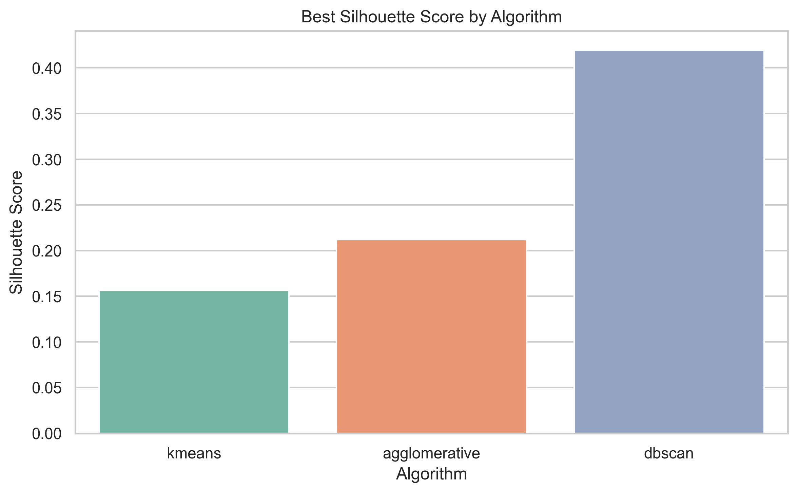

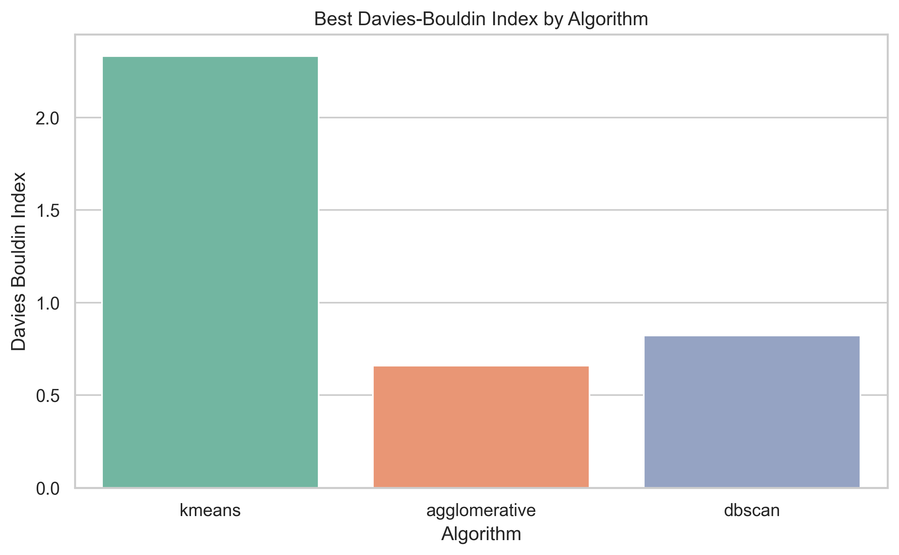

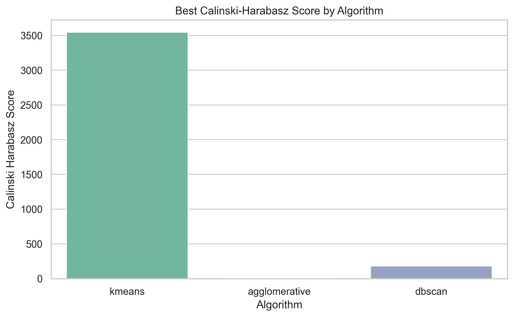

Pelo criterio principal adotado, o melhor algoritmo foi **dbscan**, com Silhouette Score de **0.4194**.

## 9. Interpretacao dos Clusters
A tabela de contingencia do melhor K-Means frente ao rotulo original foi:

| cluster | 0.0 | 1.0 |
| --- | --- | --- |
| 0 | 5962 | 2156 |
| 1 | 11286 | 596 |

A tabela percentual correspondente foi:

| cluster | 0.0 | 1.0 |
| --- | --- | --- |
| 0 | 73.4417 | 26.5583 |
| 1 | 94.9840 | 5.0160 |

Para Agglomerative Clustering:

| cluster | 0.0 | 1.0 |
| --- | --- | --- |
| 0 | 8606 | 1393 |
| 1 | 1 | 0 |

| cluster | 0.0 | 1.0 |
| --- | --- | --- |
| 0 | 86.0686 | 13.9314 |
| 1 | 100.0000 | 0.0000 |

Para DBSCAN:

| cluster | 0.0 | 1.0 |
| --- | --- | --- |
| -1 | 8465 | 1360 |
| 0 | 118 | 0 |
| 1 | 37 | 0 |
| 2 | 20 | 0 |

| cluster | 0.0 | 1.0 |
| --- | --- | --- |
| -1 | 86.1578 | 13.8422 |
| 0 | 100.0000 | 0.0000 |
| 1 | 100.0000 | 0.0000 |
| 2 | 100.0000 | 0.0000 |

No melhor K-Means, o cluster com maior proporcao de individuos com diabetes foi o cluster **0.0**, com **26.56%** de casos positivos.

Esse cluster apresentou 

No melhor Agglomerative, o cluster com maior proporcao de diabetes foi **0.0**, com **13.93%**.

No melhor DBSCAN, a maior proporcao de diabetes apareceu em **-1.0**, com **13.84%**.

Os perfis medios reforcam a relevancia de variaveis como BMI, HighBP, HighChol, GenHlth, Age, Income e Education. No K-Means, o cluster de maior risco mostrou maior BMI medio, maior prevalencia de pressao alta e colesterol alto, pior saude geral, maior idade media e menor renda media, o que e coerente com um perfil de vulnerabilidade cardiometabolica.

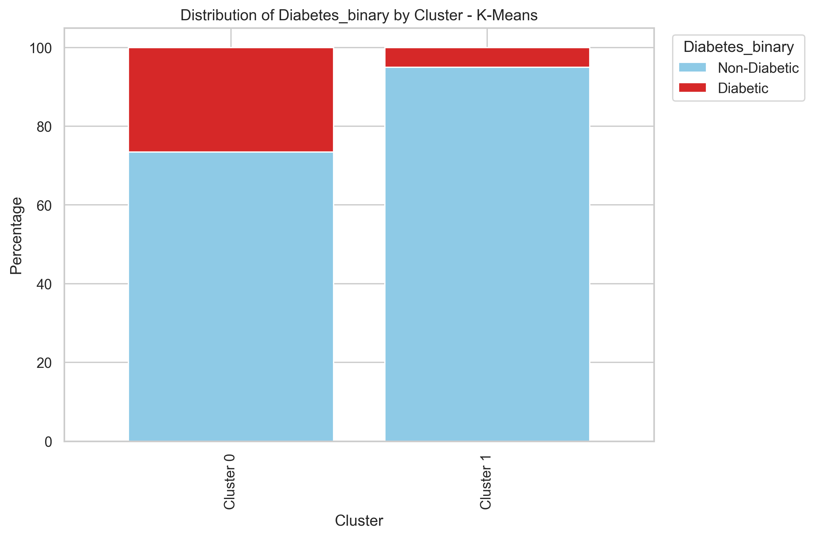

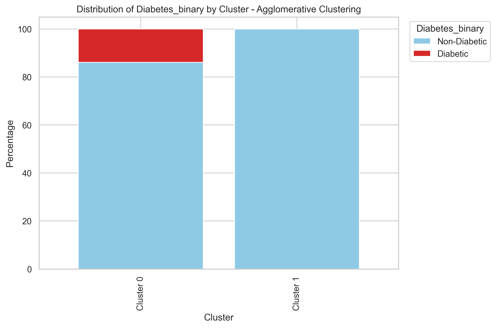

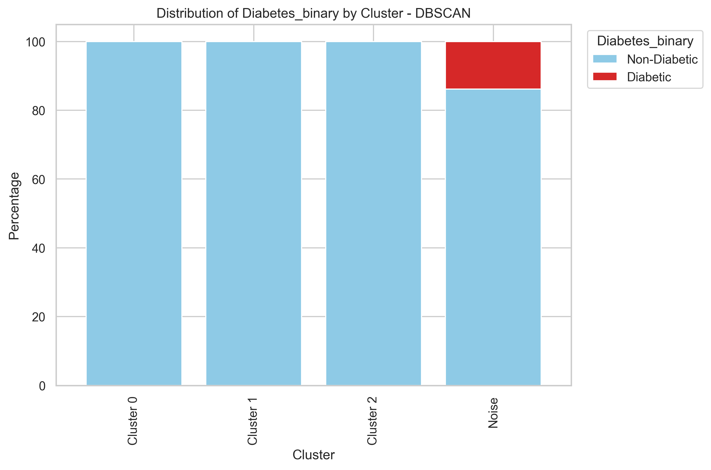

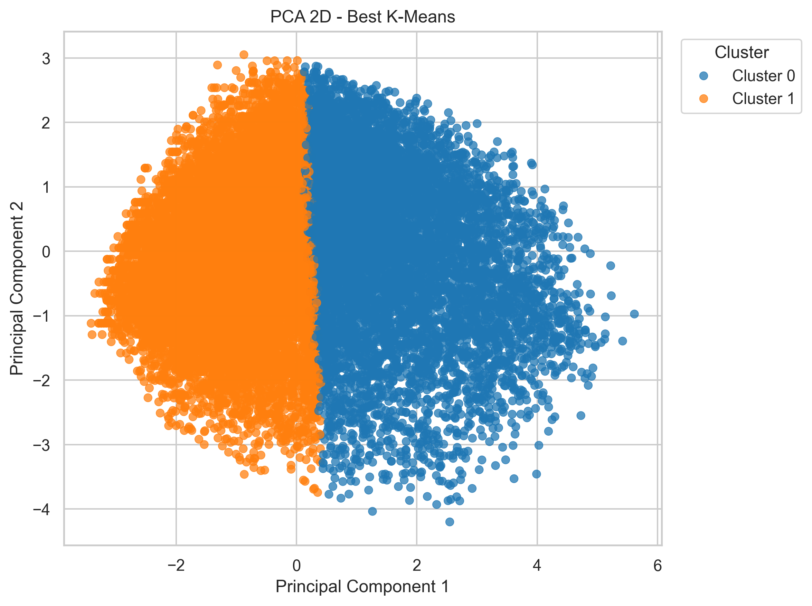

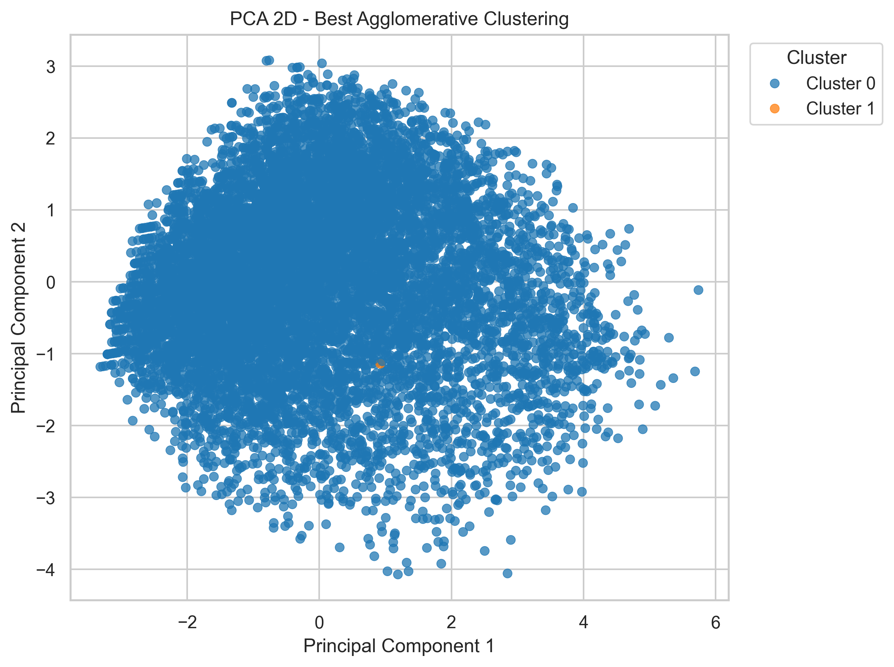

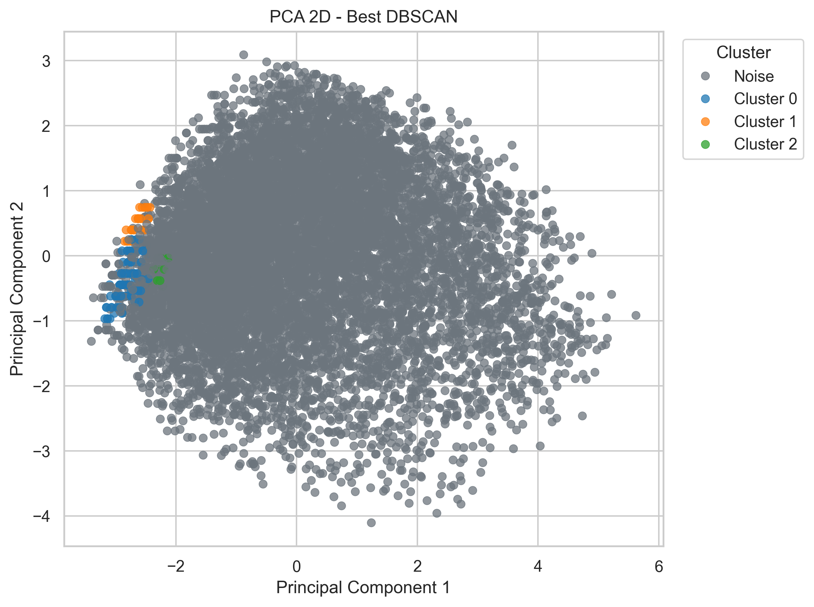

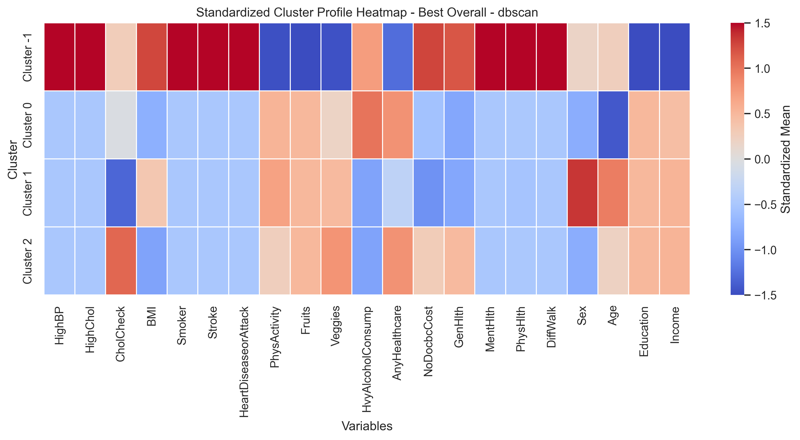

## 10. Discussao
Os algoritmos apresentaram comportamentos distintos. O K-Means produziu uma segmentacao simples e interpretavel, destacando dois perfis relativamente contrastantes. O Agglomerative Clustering obteve resultado um pouco melhor em Silhouette do que o K-Means, mas a melhor configuracao encontrada por single linkage gerou um cluster muito pequeno, o que limita sua utilidade pratica.
O DBSCAN obteve o melhor Silhouette Score geral, mas isso ocorreu ao custo de classificar **98.25%** das instancias da amostra como ruido quando o melhor algoritmo geral foi DBSCAN, o que reduz fortemente a interpretabilidade e a cobertura da solucao.
Entre as principais limitacoes do estudo, destacam-se: (1) o DBSCAN tende a perder poder discriminativo em alta dimensionalidade; (2) metricas internas nem sempre correspondem ao rotulo clinico real; (3) o BRFSS e um survey baseado em autorrelato, sujeito a vieses de memoria e declaracao.

## 11. Conclusao
O melhor algoritmo segundo o criterio principal adotado foi **dbscan**. Ainda assim, a interpretacao substantiva sugere que a qualidade de um clustering em saude nao deve ser avaliada apenas por uma metrica interna isolada, mas tambem por estabilidade, cobertura e capacidade de produzir perfis clinicamente plausiveis.
Os resultados indicaram a existencia de perfis com maior risco cardiometabolico, caracterizados por maior BMI, maior frequencia de pressao alta e colesterol alto, pior saude geral, idade mais avancada e menor renda. Em todo o processo, o rotulo `Diabetes_binary` foi mantido fora da clusterizacao e utilizado apenas posteriormente para interpretacao dos grupos.

## 12. Referencias
- Centers for Disease Control and Prevention (CDC). *Behavioral Risk Factor Surveillance System, 2015*. Disponivel em: https://www.cdc.gov/brfss/annual_data/annual_2015.html
- Liu X, et al. *Association between diabetes, metabolic syndrome and heart attack in US adults: a cross-sectional analysis using the Behavioral Risk Factor Surveillance System 2015*. BMJ Open, 2019. Disponivel em: https://pmc.ncbi.nlm.nih.gov/articles/PMC6747668/
- Scikit-learn Developers. *KMeans*. Disponivel em: https://scikit-learn.org/stable/modules/generated/sklearn.cluster.KMeans.html
- Scikit-learn Developers. *AgglomerativeClustering*. Disponivel em: https://scikit-learn.org/stable/modules/generated/sklearn.cluster.AgglomerativeClustering.html
- Scikit-learn Developers. *DBSCAN*. Disponivel em: https://scikit-learn.org/stable/modules/generated/sklearn.cluster.DBSCAN.html